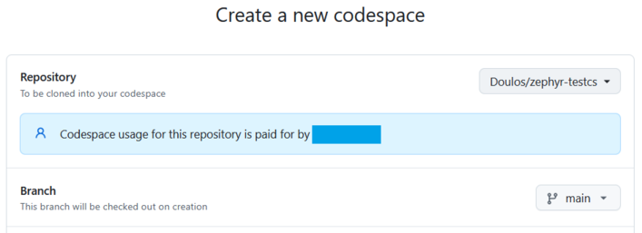
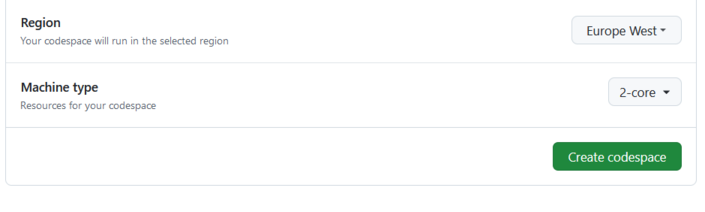
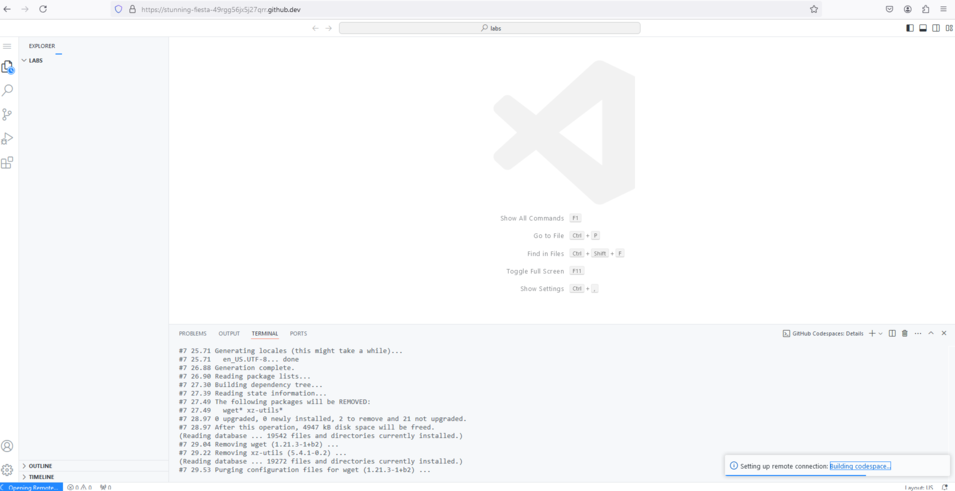
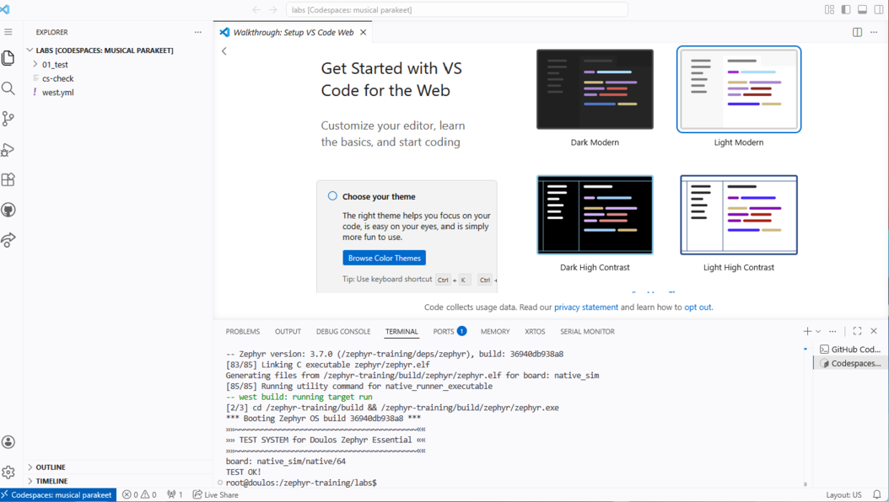

# Doulos Zephyr Essential - Training Playground Test

Follow the instructions below to verify you can access the Doulos training
playground from within your region/organization.

**Please read through** this short README **before starting** the Codepsace Setup steps.

> [!NOTE]
> If everything runs smooth, you only need two mouse clicks to run the test
> once logged to GitHub.
> Most of the problems will happen during the step **Codespace Setup**. 
> Please contact your Doulos representative if you encouter any issues.

## Codespace Setup

1. Sign in to Github using your account.
2. Open the Doulos Codespace configuration by clicking on the icon below.   
   
 If that doesn't work, follow this link: [https://codespaces.new/Doulos/zephyr-testcs](https://codespaces.new/Doulos/zephyr-testcs)

3. **If step 2 fails**, try to setup codespace manually.

   1. Follow [this link](https://github.com/codespaces/new) or alternatively click on **☰ >Codespaces > New codespace**
   2. Repository: Select `Doulos/zephyr-testcs`

>[!NOTE]
> All GitHub personal accounts include a [free monthly quota](https://docs.github.com/en/billing/concepts/product-billing/github-codespaces#free-quota)
> for GitHub Codespace. Unless you are already using Codespace for other
> purposes, no fees should be inccured.

## Creating a Codespace Machine

1. Change the **Region** if the default selected region does not
   match your geographical location
2. Create your codespace by clicking on the green button **Create codespace**

3. The codespace machine is being built. **This can take up to 5 minutes.** 
   Click on "Building codespace..." (at the bottom) to see progress

## Testings

1. Once the codespace machine is up and running:
   - you get a "Get Started with VSCode for the Web" page
   - VS Code setup takes 1-2 minutes. Once completed a zephyr test
     program is built and run in the terminal  
     You should see a **"TEST OK!"** message

2. You're done. Close your browser.  
   The codespace machine will stop automatically after a period of inactivity.

